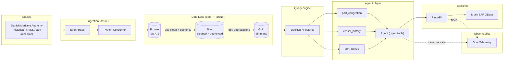
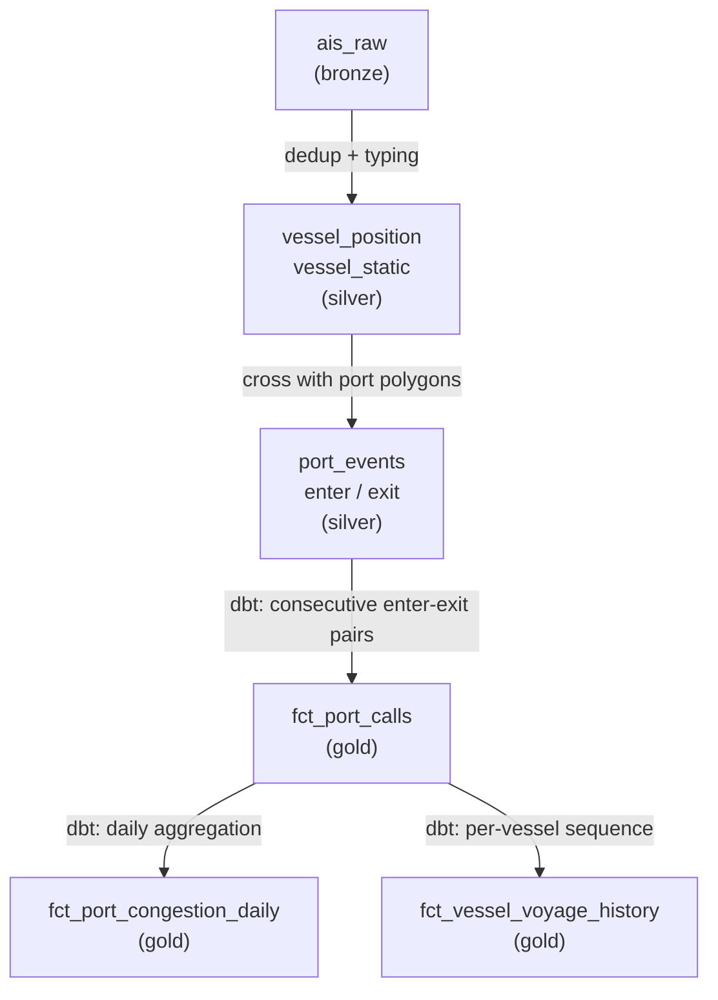
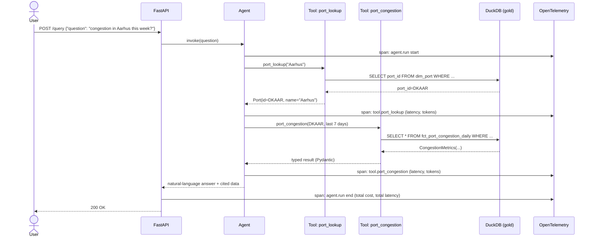
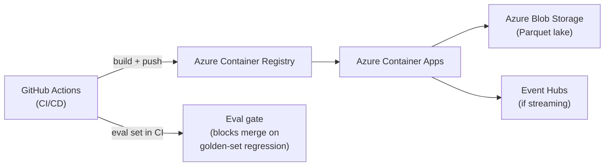

# Architecture

## Overview

The system has three blocks: **data ingestion/pipeline**, **semantic layer + agent**, and
**backend/observability**. Each one can be run, tested, and deployed independently.

## Layer model (medallion)

Full schema detail in [04-data-model.md](04-data-model.md). In short:

- **Bronze**: raw AIS messages, append-only, untransformed.
- **Silver**: deduplicated, typed, crossed against port geofences → enter/exit events.
- **Gold**: business-ready dbt marts (dwell time, daily congestion, call history).

## Sequence: a user query

This is the flow traced in OpenTelemetry — every tool call is recorded with latency,
tokens, and cost.

Key design points in this sequence:

- The agent **never** generates free-form SQL — each tool runs a fixed, parameterized query against
  the gold layer. This is what separates a "production agent" from a "text-to-SQL demo", and is the
  central argument of [05-agent-tools-eval.md](05-agent-tools-eval.md) and [06-security.md](06-security.md).
- Each tool call is an independent span — this lets you answer "why did this response take 4
  seconds?" or "how much did this query cost?" without ad-hoc instrumentation.

## Simulated enterprise integration

A mock SAP OData-style endpoint (`/sap/PortCallSet`) simulates the kind of integration the posting
mentions ("SAP and non-SAP"). It's not functional against a real SAP system — it's an OData contract
served by FastAPI that demonstrates understanding the integration pattern the role expects.

## Deployment

The eval set runs as a CI gate, not a manual test — if a change to the tools or the agent's prompts
breaks a golden answer, the pipeline fails. See [05-agent-tools-eval.md](05-agent-tools-eval.md).

See [03-tech-stack.md](03-tech-stack.md) for why each piece was chosen, and
[07-scope-cutlines.md](07-scope-cutlines.md) for the reduced version of this diagram (batch,
1 port, local DuckDB).
