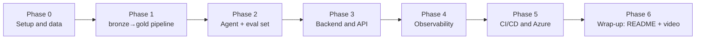

# Project phases

Every phase ends in something demonstrable, not an internal checkpoint. If time runs out halfway
through, the project should be showable as "this is how far I got" without being left in a broken
state. Order matters: each phase depends on the previous one having its gate met, not just "code
written".

See [07-scope-cutlines.md](07-scope-cutlines.md) for what gets reduced within each phase if time is
tight (streaming→batch, several ports→one, etc.) — this document assumes the cut has already been
decided and orders the remaining work.

---

## Phase 0 — Setup and data validation

**Objective**: confirm the real data supports the model before writing a single line of pipeline
code.

- Download the historical AIS dataset from the Danish Maritime Authority for the chosen port.
- Inspect real field coverage: what % of messages carry `vessel_static` (name, IMO)? Is position
  frequency enough for reliable geofencing?
- Confirm or adjust the schema in [04-data-model.md](04-data-model.md) against what the data
  actually looks like (it's a design document, not a closed contract).
- Repo structure: Python environment, `pyproject.toml`, `bronze/`, `dbt/`, `agent/`, `api/` folders.

**Deliverable**: an exploratory notebook or script with real dataset statistics, and the adjusted
schema if needed.

**Done when**: you can state, with data in hand, "there's enough signal to calculate dwell time and
detect arrival/departure at this port" — not an assumption.

**Main risk**: `vessel_static` coverage is so low that `vessel_history` ends up poor. If that
happens, mitigate by falling back on `mmsi` itself as the primary identifier and treating the name
as an optional field throughout the chain.

---

## Phase 1 — Data pipeline (bronze → silver → gold)

**Objective**: the gold layer exists and has believable numbers.

- Batch ingestion of the historical data into `bronze/ais_raw` (Parquet).
- dbt: cleaning + dedup + crossing against the port geofence → `silver.vessel_position`,
  `silver.port_events`.
- dbt: `fct_port_calls`, `fct_port_congestion_daily`, `fct_vessel_voyage_history` marts.
- dbt tests: `not_null`, `unique`, `relationships`, `accepted_range` on `dwell_hours`.

**Deliverable**: a loadable `duckdb` file where `select * from fct_port_congestion_daily` returns
rows that make sense (congestion that rises and falls plausibly, not flat noise).

**Done when**: `dbt test` passes green and a manual inspection of 5-10 rows from each mart makes
business sense (every number can be explained without hesitation).

**Depends on**: Phase 0 (schema confirmed against real data).

---

## Phase 2 — Agentic layer and eval set

**Objective**: the agent answers correctly, and "correctly" is measured, not assumed.

- Implement the 3 typed tools (`port_lookup`, `port_congestion`, `vessel_history`) over gold —
  contracts in [05-agent-tools-eval.md](05-agent-tools-eval.md).
- Agent runner (Claude API + tool use), no heavy framework.
- 15-question eval set with golden answers, including the prompt injection cases via
  `vessel_static.name`.
- Eval script that runs locally and reports % correct per category.

**Deliverable**: a CLI or script (`python -m agent.eval`) that runs the 15 questions and shows a
pass/fail report.

**Done when**: the eval set runs end to end and the injection cases are effectively blocked — it's
not enough for the "normal" questions to work.

**Depends on**: Phase 1 (gold with real data — without this, the eval set measures against noise).

**This is the phase that never gets cut** ([07-scope-cutlines.md](07-scope-cutlines.md)) — it's the
project's central differentiator.

---

## Phase 3 — Backend and API

**Objective**: the agent is a service, not a script.

- FastAPI wrapping the agent runner (`POST /query`).
- Read-only mock SAP OData endpoint (`/sap/PortCallSet`).
- Simple auth (API key) + rate limiting.

**Deliverable**: API running locally with browsable Swagger/OpenAPI, and a real query via
`curl`/Postman returning the agent's answer.

**Done when**: the full "natural-language question → answer with cited data" demo works over HTTP,
not just in the eval script.

**Depends on**: Phase 2 (agent working and evaluated before exposing it).

---

## Phase 4 — Observability

**Objective**: "how much did this query cost and where did the time go?" can be answered with data,
not an estimate.

- Instrument OpenTelemetry: one span per tool call (latency, tokens) and one span per full request
  (total cost).
- Export to something visualizable (structured console, or local Jaeger if time allows).

**Deliverable**: an end-to-end trace of a query showing the per-tool-call breakdown, captured as
evidence (screenshot or export) for the README.

**Done when**: the "eval results" and "cost per query" metrics in the
[root README](../README.md) are filled in with real numbers, not left as placeholders.

**Depends on**: Phase 3 (needs the full flow through the API to trace something representative).

### Real evidence (implemented)

Implementation: [agent/tracing.py](../agent/tracing.py) (OpenTelemetry setup, two exporters in
parallel), the `@_traced` decorator in [agent/tools.py](../agent/tools.py) (one span per tool call),
the `agent.run` span in [agent/runner.py](../agent/runner.py) (one span per question), and
`FastAPIInstrumentor` in [api/main.py](../api/main.py) (one span per HTTP request). All three levels
end up nested under the same `trace_id` without passing context by hand — it propagates on its own
via `contextvars`, even across the threadpool where the synchronous endpoint runs
([09-theoretical-foundations.md](09-theoretical-foundations.md)).

**Two exporters, not one**: a `ConsoleSpanExporter` to `logs/traces.jsonl` (always available, serves
as reproducible evidence with no external dependency) and an `OTLPSpanExporter` to a local Jaeger —
the upgrade this very document had left noted as optional ("local Jaeger if time allows",
[07-scope-cutlines.md](07-scope-cutlines.md)). To spin it up:

```bash
docker run -d --name jaeger -p 16686:16686 -p 4317:4317 -p 4318:4318 jaegertracing/all-in-one:latest
```

UI at `http://localhost:16686`. If the container isn't running, the `BatchSpanProcessor` retries in
the background without breaking the request — the file still captures everything either way. Real
trace verified in Jaeger: a 7.47s `POST /query`, 6 spans, depth 3 (request → `agent.run` →
`tool.vessel_history`).

Real tree captured from a run against `POST /query`:

```
POST /query                                          [http.status_code=200]
└─ agent.run                                          [model=claude-opus-5, api_calls=3,
   │                                                    input_tokens=5902, output_tokens=348,
   │                                                    cost_usd=0.03821]
   ├─ tool.port_lookup       [input={"query":"Aarhus"}, output_bytes=62]
   └─ tool.port_congestion   [input={"port_id":"DKAAR","date_from":"2025-02-20","date_to":"2025-02-26"},
                               output_bytes=199]
```

This directly answers this phase's objective question: "how much did this query cost and where did
the time go?" — $0.038, 2 tool calls, nothing estimated.

---

## Phase 5 — CI/CD and Azure deployment

**Objective**: "runs on Azure" is verifiable with a URL, not a claim.

- Dockerize the API (and the dbt job, if the chosen cut requires it).
- GitHub Actions: build + test, with the Phase 2 eval set running as a merge gate.
- Deploy to Azure Container Apps.

**Deliverable**: a public (or credential-accessible) URL of the API running on Azure, and a visible
GitHub Actions run with the eval set green.

**Done when**: a change that breaks a golden answer actually fails the CI pipeline — test this on
purpose once, don't assume the gate works.

**Depends on**: Phases 3 and 4 (what gets dockerized and deployed is already complete and traced).

### Real evidence (applied to a real Azure subscription)

Dockerization is done: [Dockerfile](../Dockerfile) builds a slim, non-root image with the DuckDB
warehouse baked in at build time (consistent with the "batch, already-processed data" cut,
[07-scope-cutlines.md](07-scope-cutlines.md)).

The Azure IaC is written as Terraform modules + Terragrunt environments (Gruntwork-style
`modules/` + `live/` split, one `dev` environment structured so `staging`/`prod` are a copy-and-edit
away, no module changes) — full detail in [infra/README.md](../infra/README.md). It was applied for
real, end to end: resource group → storage/log analytics/registry → container app environment →
container app, all created in a real Azure subscription (`swedencentral`).

**The API is live**: `https://ca-portintel-dev--96is9kz.nicemushroom-b8b4d37f.swedencentral.azurecontainerapps.io`
— `/health`, the authenticated `/sap/PortCallSet`, and `/query` (the real agent, calling the real
Claude API) all verified responding `200` from that URL, not from a local machine.

### Real problems hit during the actual apply (and why they're worth keeping)

None of these were config mistakes caught by `validate` — they only surface when you actually try to
create resources in a real subscription, which is exactly why "plan looks clean" and "it deployed"
are different claims:

- **Region rejected the account**: `westeurope` returned `RequestDisallowedByAzure: ... not accepting
  new customers` on the storage account. Fixed by moving both the bootstrap and `dev/env.hcl` to
  `swedencentral` — also a better geographic fit for a Danish-data PoC.
- **Resource provider not registered**: `Microsoft.App` (Container Apps) returned
  `MissingSubscriptionRegistration` on a subscription that had never used it before. One-time fix:
  `az provider register --namespace Microsoft.App`, then wait for `registrationState = Registered`.
- **Image architecture mismatch**: the first image was built on Apple Silicon with a plain
  `docker build`, producing an arm64-only manifest. Azure Container Apps rejected it at revision
  provisioning time (`no child with platform linux/amd64 in index ...`). Fixed with
  `docker buildx build --platform linux/amd64 ... --push`.
- **Orphaned resource after a failed apply**: the container app with the bad image was actually
  created in Azure before Terraform's polling step failed waiting for it to become healthy — so the
  resource existed in Azure but not in Terraform state. `terraform import` couldn't recover it either
  (Azure refuses to return secrets for a container app stuck in `ProvisioningState: Failed`). Resolved
  by deleting the broken resource directly (`az containerapp delete`) and re-applying clean rather
  than fighting an import against a resource in a dead state.

**Still open**: GitHub Actions (build + eval-gate + deploy) — the manual sequence above (documented
in [infra/README.md](../infra/README.md)) works and is verified, but isn't automated yet.

---

## Phase 6 — Wrap-up: README, security, and video

**Objective**: the repo is self-contained for anyone reading it from the cover-letter link.

- Fill in the eval results and cost-per-query tables in the [root README](../README.md) with the
  real numbers from Phases 2 and 4.
- Review [06-security.md](06-security.md) against what was actually implemented — if something was
  cut (e.g., Key Vault), document it as a known gap instead of leaving it out.
- Record the 3-minute Loom: problem → live demo → eval results → one sentence on the security angle.

**Deliverable**: finished repo + Loom link, ready to paste into the cover letter.

**Done when**: someone who's never seen the project before can, in 3 minutes of video plus 5 minutes
of README, understand what was built, why, and how well it works — with evidence, not adjectives.

**Depends on**: all of the above.

---

## Dependency summary



No phase is parallelizable with the next because each one consumes the previous one's deliverable as
input — that's intentional: if time runs out, the project stays in a coherent, demonstrable state at
the last completed phase, instead of having loose, half-finished pieces on several fronts.
